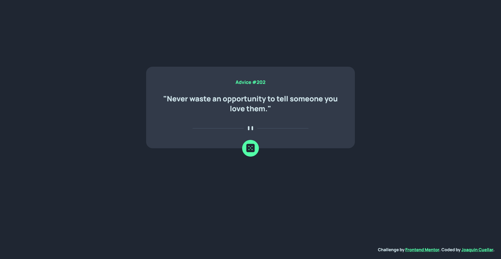

# Frontend Mentor - Advice generator app solution

This is a solution to the [Advice generator app challenge on Frontend Mentor](https://www.frontendmentor.io/challenges/advice-generator-app-QdUG-13db). Frontend Mentor challenges help you improve your coding skills by building realistic projects.

## Table of contents

- [Overview](#overview)
  - [The challenge](#the-challenge)
  - [Screenshot](#screenshot)
  - [Links](#links)
- [My process](#my-process)
  - [Built with](#built-with)
  - [What I learned](#what-i-learned)
- [Author](#author)
- [Acknowledgments](#acknowledgments)

## Overview

### The challenge

Users should be able to:

- View the optimal layout for the app depending on their device's screen size
- See hover states for all interactive elements on the page
- Generate a new piece of advice by clicking the dice icon

### Screenshot

### Links

- Solution URL: [Add solution URL here](https://www.frontendmentor.io/challenges/advice-generator-app-QdUG-13db/hub/advice-generator-applet-B1IYrU-Qc)
- Live Site URL: [Add live site URL here](https://joaquin-cuellar.github.io/Advice-Generator-Applet/)

## My process

### Built with

- Semantic HTML5 markup
- JavaScript
- CSS
- [Advice Slip API](https://api.adviceslip.com)
- ['We Stand with Ukraine' Plugin](https://github.com/virae/we-stand-with-ukraine)
- [Animate.CSS API](https://animate.style/)

### What I learned

## Author

- Website - [Joaquin Cuellar](https://github.com/joaquin-cuellar)

## Acknowledgments
